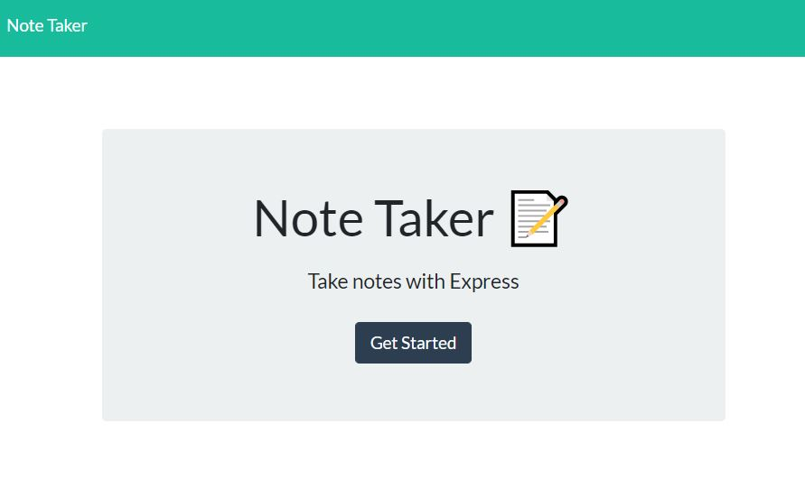

# Express.js-Note-Taker

## Table of Contents

- [Description]
- [Usage]
- [Links]
- [Questions]

## Description

A website that allows the user to take notes and write a description for each note. The website will store the note once it's written by the user, and the user may delete the note. 

## Usage

The user will first encounter a landing page where they can click a link that takes them to the note page. 

## Links

Link to Heroku: 

## Questions

For any questions feel free to reach out:  
Email: <georginalevitki@gmail.com>
